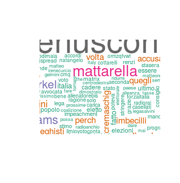

# TwitterAnalysis
This is an exercise to do sentiment analysis by means of R+API.
To work you should fill your credential for your API.
At the moment (29/05/18) once you chose a word (in the
example : "Berlusconi") it products a wordcloud.

Next step:a) add sentimental analysis
b)map of the location of twitter
c)shiny app to interact and chose directly the word
d)compare with other sources (facebook api for ex)

